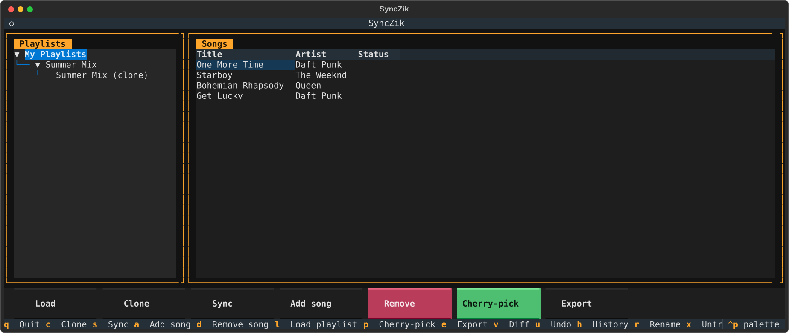

# SyncZik

[](https://github.com/dimiarbre/SyncZik/actions/workflows/ci.yml)
[](LICENSE)
[](pyproject.toml)

**Git for playlists** — fork, sync, cherry-pick, and export playlists across streaming platforms.



## What it does

SyncZik brings a git-like workflow to your music playlists:

- **Clone** any playlist (yours or someone else's) and get an independent copy you can modify
- **Sync** bidirectionally: changes made on Spotify are pulled in; local edits are pushed back
- **Cherry-pick** individual songs from any playlist into yours — without cloning the whole thing
- **Diff** two playlists to see what songs each one has exclusively
- **Export** a playlist to another platform, with an interactive conflict resolver when songs aren't found

### Example workflow

```
# You like someone's playlist. You want some of its songs, not all.
# 1. Load their playlist URL in SyncZik.
# 2. Press P (Cherry-pick), select the songs you want → they're staged locally.
# 3. Press S (Sync) → staged additions are pushed to Spotify.
#
# Later, you want to export your playlist to Deezer.
# 4. Press E (Export). For each song not found on Deezer, a dialog appears:
#    pick the best match, search manually, or skip.
```

## Supported platforms

| Platform | Read | Write | Clone source | Clone target |
|----------|------|-------|-------------|--------------|
| Spotify  | ✓    | ✓     | ✓           | ✓            |
| Deezer   | ✓    | ✓     | ✓           | ✓            |

Choose your home provider (Spotify or Deezer) at startup — that's the platform Load/Clone/Sync operate against. Export can target either platform regardless of your home provider.

## Setup

### 1. Install

```bash
python3.12 -m venv venv-python3.12-SyncZik
source venv-python3.12-SyncZik/bin/activate
pip install -e ".[dev]"
```

### 2. Spotify credentials

Copy `.env.example` to `.env`. Create an app at [developer.spotify.com](https://developer.spotify.com), add `http://localhost:8888/callback` as a redirect URI, then fill in:

```env
SPOTIFY_CLIENT_ID=your_client_id
SPOTIFY_CLIENT_SECRET=your_client_secret
SPOTIFY_REDIRECT_URI=http://localhost:8888/callback
SPOTIFY_USER_ID=your_spotify_username
```

A missing `SPOTIFY_CLIENT_ID`/`SPOTIFY_CLIENT_SECRET` is caught at startup with a message telling you what's missing, rather than failing deep inside `spotipy`.

### 3. Deezer credentials (needed to use Deezer as your home provider or as an export/cherry-pick target)

Register an app at [developers.deezer.com](https://developers.deezer.com), then complete Deezer's OAuth authorize redirect once in a browser to get an access token (SyncZik doesn't automate this step the way it does for Spotify — there's no refresh flow, so if the token expires you'll need to repeat this and update `.env`). Add it to `.env`:

```env
DEEZER_ACCESS_TOKEN=your_access_token
```

### 4. Run

```bash
syncZik
```

On first launch you're asked to choose your home provider (Spotify or Deezer). Choosing Spotify opens a browser window for login; the TUI launches after authentication (or immediately for Deezer, using `DEEZER_ACCESS_TOKEN`).

## CLI usage (scripting / cron)

Passing a subcommand skips the TUI entirely — useful for cron jobs or scripts:

```bash
syncZik clone <playlist-url-or-id> "My Clone" [--service spotify|deezer]
syncZik sync <playlist-id> [--service spotify|deezer]     # one tracked playlist
syncZik sync --all                                        # every tracked playlist
syncZik cherry-pick <target-id> <source-url-or-id>        # pulls every new song, no picking
syncZik export <source-id> <spotify|deezer> "Export Name" # auto-resolved matches only, conflicts skipped
```

The CLI reuses the same `sync_engine.py`/`playlist_git.py` functions as the TUI, so state stays consistent between the two — a playlist cloned from the TUI can be synced from cron and vice versa. Unlike the TUI, `export`/`cherry-pick` don't have anyone to resolve conflicts or pick songs interactively, so `export` only includes exact/ISRC matches (reporting how many were skipped) and `cherry-pick` pulls in every song the target doesn't already have. `--verbose` enables debug-level logging; see [Local data](#local-data) for where the log file lives.

## TUI usage

```
┌──────────────────────────────────────────────────────────────────────────┐
│  SyncZik                                                                 │
├──────────────────────┬───────────────────────────────────────────────────┤
│ Playlists            │ Songs                                             │
│                      │                                                   │
│  My Playlists        │  Title                Artist          Status      │
│  ├── Playlist A      │  One More Time        Daft Punk                   │
│  │   └── My Clone    │  Bohemian Rhapsody    Queen           [local]     │
│  └── Another         │  Starboy              The Weeknd                  │
│                      │                                                   │
├──────────────────────┴───────────────────────────────────────────────────┤
│ [Load] [Clone] [Sync] [Add song] [Remove] [Cherry-pick] [Export]        │
└──────────────────────────────────────────────────────────────────────────┘
```

### Actions

| Key / Button    | Action |
|-----------------|--------|
| `L`             | **Load** — paste a playlist URL or ID from your home provider to import it locally |
| `C`             | **Clone** — fork the selected playlist; creates a new playlist on your home provider and tracks it |
| `S`             | **Sync** — bidirectional merge: pushes local changes, pulls remote changes |
| `A`             | **Add song** — search your home provider and stage a song (shown as `[local]` until Sync) |
| `D`             | **Remove** — stage the selected song for removal (applied on next Sync) |
| `P`             | **Cherry-pick** — enter another playlist URL, browse songs not in your playlist, pick any |
| `E`             | **Export** — export to another platform; conflicts resolved song-by-song in a GUI dialog |
| `V`             | **Diff** — compare the selected playlist against another tracked one, song-by-song |
| `U`             | **Undo** — undo the last staged Add/Remove/Cherry-pick |
| `H`             | **History** — view past syncs/clones for the selected playlist, revert to an earlier point |
| `R`             | **Rename** — rename the selected playlist locally |
| `X`             | **Untrack** — stop tracking the selected playlist locally (does not touch the remote) |
| `?`             | **Help** — keybinding and workflow reference |
| `Q`             | Quit |

Network calls (Load/Clone/Sync/Search/Export/Cherry-pick) run off the UI thread with a loading indicator, so the app stays responsive on large playlists. Every dialog can be backed out of with `Escape`.

### Cherry-pick workflow

1. Select a target playlist.
2. Press `P`, paste the source playlist URL.
3. Songs not yet in your playlist appear. Toggle with Enter or Space, then **Pick selected** or **Select all**.
4. Picked songs are staged locally — press `S` to push them to your home provider.

### Export workflow

1. Select the playlist to export.
2. Press `E`, enter a name for the exported playlist.
3. Songs with exact matches (title + artist, ignoring `feat.` noise) are auto-resolved.
4. For each conflict a dialog shows:
   - **Ambiguous** — candidates found but not a clear match; pick one or skip.
   - **Not found** — no results; search manually on the target or skip.
5. The exported playlist is created with all resolved songs.

## Architecture

```
src/SyncZik/
├── providers/
│   ├── base.py           # ServiceProvider ABC — unified API for all platforms
│   ├── spotify.py        # SpotifyProvider (full read + write)
│   └── deezer.py         # DeezerProvider (full read + write)
├── syncer.py             # Playlist, Song, Artist data models
├── snapshot_handler.py   # Local state and baseline snapshot persistence
├── sync_engine.py        # Clone / sync (bidirectional merge) logic
├── playlist_git.py       # diff, cherry_pick, fork_from_user, songs_in_playlist, log, revert
├── cross_platform.py     # plan_export, execute_export, conflict classification
├── retry.py              # with_retry() — backoff for transient provider failures
├── exceptions.py         # SyncZikError hierarchy
├── auth.py               # Spotify OAuth singleton, Deezer client
├── config.py             # .env loading
├── logging_setup.py      # rotating debug log file
├── cli.py                # headless clone/sync/cherry-pick/export subcommands
└── tui.py                # Textual terminal UI + all modal screens
```

### Sync model

```
Baseline snapshot  ←  last common state (saved locally after each sync)
       │
       ├── Remote diff  (what changed on Spotify since baseline)
       └── Local diff   (what you changed locally since baseline)
              ↓
         Merge result → applied to both local state and remote
         Conflicts     → surfaced to user via TUI modal
```

### Cross-platform export model

```
Source playlist songs
       │
       └── plan_export(target_provider)
             ├── EXACT match    → auto-resolved
             ├── AMBIGUOUS      → ExportConflictScreen (user picks)
             └── NOT_FOUND      → ExportConflictScreen (user searches / skips)
                    ↓
              execute_export(target_provider) → new playlist on target
```

## Local data

All of it lives under an OS-appropriate data directory — on Linux
typically `~/.local/share/SyncZik`, on macOS `~/Library/Application
Support/SyncZik`, on Windows `%LOCALAPPDATA%\SyncZik` (via
[platformdirs](https://pypi.org/project/platformdirs/)) — override it
with the `SYNCZIK_DATA_DIR` environment variable.

| Path (relative to the data dir) | Contents |
|------|----------|
| `state/{service}/{id}.json` | Local playlist state (working tree) |
| `snapshots/{service}/{id}/{timestamp}.json` | Versioned baseline snapshots — one per Clone/Sync, oldest to newest |
| `.spotify_cache` (repo-relative, not yet migrated) | Cached OAuth token |
| `$XDG_STATE_HOME/synczik/log/synczik.log` (defaults to `~/.local/state/synczik/log/`) | Rotating debug log — errors/warnings from both the TUI and CLI, not just the ephemeral toast/stderr line. `--verbose` (CLI) logs at debug level. |

If you used SyncZik before this existed, your old CWD-relative `state/`
and `snapshots/` directories are copied (never deleted or overwritten)
into the new location automatically the first time you run it — check
stderr/the log for a one-line notice when that happens.

Every Clone/Sync records a new snapshot version instead of overwriting the last one, so the `H` (History) screen can show a `git log`-style view of what changed at each point and revert local state to any of them (local-only — the remote is untouched until you Sync again). Installs from before snapshot versioning existed keep working: a legacy flat `snapshots/{service}/{id}.json` file is still read as a fallback until the next save.

State and snapshot files are written atomically (temp file + rename), so a crash or interrupted process mid-save can't leave a corrupted file behind.

Outbound Spotify/Deezer API calls are retried with exponential backoff on rate limits (429) and transient server/network errors; a failure that persists through retries is surfaced as a `SyncZikError` subclass (`ProviderAuthError`, `ProviderRateLimitError`, `ProviderNotFoundError`) with an actionable message instead of a raw library exception. A sync that fails partway through a push/removal reports it in the result rather than silently marking the playlist as up to date.

## Troubleshooting / FAQ

**Spotify login opens a browser but nothing happens / redirect fails.**
Double-check `SPOTIFY_REDIRECT_URI` in `.env` matches *exactly* (including
trailing slash) a Redirect URI registered on your app at
[developer.spotify.com](https://developer.spotify.com).

**"Missing required .env variable(s)" at startup.**
Copy `.env.example` to `.env` and fill in the missing value(s) named in
the error — SyncZik checks for these before attempting to talk to
Spotify/Deezer, rather than failing deep inside the API client.

**Deezer says my token isn't working anymore.**
Deezer access tokens don't refresh automatically (unlike Spotify's OAuth
flow). Repeat the authorize-redirect step in Setup step 3 and update
`DEEZER_ACCESS_TOKEN` in `.env`.

**My playlist tree is empty even though I know I've tracked playlists before.**
If this is your first run after upgrading from a version predating the
XDG data-dir change, the migration notice (stderr / the log file) tells
you if it ran. If you're intentionally pointing `SYNCZIK_DATA_DIR`
somewhere new, that's expected — nothing is tracked there yet.

**Where's the log file?**
Shown in the TUI's Help screen (`?`) and in the Local data table above.
Attach the relevant excerpt when filing a bug report.

## Tests

```bash
pip install -e ".[dev]"
pytest                                            # tests
pytest --cov=SyncZik --cov-report=term-missing    # ...with a coverage report
ruff check . && ruff format --check .             # lint + format check
mypy src/SyncZik                                  # type check
```

`pre-commit install` runs `ruff` (check + format) automatically on each commit; `pyproject.toml` has the full config.

285 tests (~75% line coverage) covering models, sync merge logic (including partial-failure and order-preservation edge cases), versioned snapshot history, XDG data-dir migration and legacy-format fallback, retry/backoff behavior, provider implementations for both Spotify and Deezer (including error translation and required-credential validation), playlist git operations (including `log`/`revert`), cross-platform export logic (including ISRC and duration-tiebreak matching), the headless CLI, the debug log setup, and the TUI (provider selection, the async worker helper behind non-blocking network calls, undo, diff, per-song sync conflict resolution, cherry-pick's toggle fix, escape-to-cancel, history/revert, and rename/untrack), driven end-to-end with Textual's `Pilot`/`run_test()`. All tests are fully mocked — no real API calls required. CI runs `ruff`, `mypy`, and `pytest` (with coverage) on every push/PR across Python 3.12 and 3.13 (see `.github/workflows/ci.yml`).

---

## Roadmap

### Done

- [x] Spotify read + write support (SpotifyProvider)
- [x] Clone any playlist (fork model with parent tracking)
- [x] Bidirectional sync with merge-base snapshot
- [x] Conflict detection: remote removal while local has changes
- [x] Bug fix: convergent adds (both sides add same song) no longer double-reported
- [x] TUI: two-panel layout, tree view, song table, action bar
- [x] TUI: search modal, sync result modal with per-song pending-removal decision
- [x] `playlist_git.py`: `diff`, `cherry_pick`, `fork_from_user`, `songs_in_playlist`
- [x] TUI: Cherry-pick modal — browse another playlist, toggle and pick songs
- [x] `cross_platform.py`: `plan_export`, `execute_export`, `_normalize` (feat. stripping)
- [x] TUI: Export conflict resolver screen — AMBIGUOUS / NOT_FOUND handled per-song
- [x] `setup.cfg` with `pythonpath = src` for correct test resolution in all contexts
- [x] **Deezer write support** — `DeezerProvider.create_playlist`/`add_songs`/`remove_songs` via deezer-python; TUI export flow can now target Deezer
- [x] **Deezer as home provider** — choose Spotify or Deezer at TUI startup; Load/Clone/Sync/Search all work against whichever is active
- [x] CI (`pytest` + `mypy`) on every push/PR; MIT license
- [x] **Reliability foundation** — retry/backoff with `Retry-After` support on rate limits and transient errors, `SyncZikError` translation at the provider boundary, atomic state/snapshot writes, partial-sync-failure reporting, ISRC-first cross-platform matching with a duration tiebreak, order-preserving remote pulls
- [x] **TUI responsiveness** — Load/Clone/Sync/Search/Export/Cherry-pick run off the UI thread with a loading indicator instead of freezing the app; `playlist_git.diff()` is now wired into the TUI (`V`); SyncResultModal's pending-removal decision is per-song, not just "remove all"/"keep all"; one-level undo (`U`) for the last staged Add/Remove/Cherry-pick; a help screen (`?`); every dialog backs out with `Escape`; Cherry-pick's "Space to toggle" hint now actually works (`ListView` only bound Enter by default); first-run onboarding hint when no playlists are tracked yet
- [x] **Playlist history** — every Clone/Sync now records a versioned snapshot; `playlist_git.log()`/`revert()` and a TUI History screen (`H`) show what changed at each point and can revert local state to any of them; local `Rename` (`R`) and `Untrack` (`X`, with confirmation) for tracked playlists
- [x] **CLI interface** — `syncZik clone|sync|cherry-pick|export` subcommands reuse the same `sync_engine.py`/`playlist_git.py` as the TUI, for scripting/cron use without an interactive terminal; a rotating debug log file (`--verbose` for debug level) instead of only ephemeral TUI toasts; required-credential validation at the point of use with an actionable message instead of an opaque failure inside `spotipy`/`deezer`; `.env.example` at the repo root
- [x] **Project maturity** — `pyproject.toml` (PEP 621) replaces `setup.py`/`setup.cfg`/`mypy.ini`; `ruff` (lint + format) added and made blocking in CI alongside `mypy` (was advisory-only); CI runs a Python 3.12/3.13 matrix with coverage reporting; `state`/`snapshots` moved from CWD-relative paths to an XDG-compliant data directory (via `platformdirs`, with a safe copy-only migration for existing installs); `.pre-commit-config.yaml`, `CHANGELOG.md`, `SECURITY.md`, issue/PR templates, README badges + a real screenshot + troubleshooting/FAQ section
- [x] 285 passing tests, ~75% line coverage (snapshot versioning/history + XDG migration, sync engine edge cases, retry/backoff, playlist git including log/revert, cross-platform, providers — Spotify and Deezer — CLI, logging setup, TUI, driven end-to-end with Textual's `Pilot`)

### Next steps

- [ ] **Song matching quality** — ISRC and duration-tiebreak matching are in; still open: transliteration (accented chars), edit-distance fallback for very similar titles, and stripping remix/live/deluxe noise from titles without risking false matches
- [ ] **Integration tests** — `tests/integration/` directory with `@pytest.mark.integration` tests that hit the real Spotify API using a fixed test playlist (skip unless credentials present)
- [ ] **Duplicate-song support** — a playlist containing the same track twice can't be represented today (dedup by ID throughout `Playlist.add_song`/`sync_engine`/both providers); a real structural change, deliberately deferred rather than bundled into playlist history
- [ ] **Full reorder-detection** — sync() now preserves order when *pulling* new songs, but a pure reorder on the remote (no add/remove) is still invisible to the diff
- [ ] **`.spotify_cache` still CWD-relative** — the OAuth token cache wasn't moved in the state/snapshots XDG migration; a smaller follow-up
- [ ] **Apple Music provider** — using the MusicKit JS API or a music-manager bridge
- [ ] **YouTube Music provider**
- [ ] **Cloud backup** — optional encrypted remote storage of `state/` + `snapshots/` for multi-device use
- [ ] **Rebase** — given baseline A, local B, and source C: apply the diff A→C onto B (like `git rebase` for playlists)
- [ ] **Share / publish** — generate a read-only shareable snapshot URL of a local playlist state
